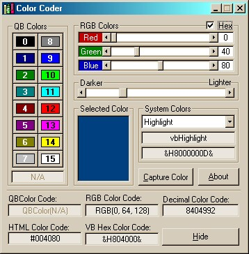



## \_Color Coder 3\.0

### Description

*Updated* This application allows you to select System colors, QBColors, or mix your own RGB colors. Then simply right-click and copy the color code to paste it into your application in VB constants, QB, RGB, Hex or HTML format. You can capture a color from anywhere on your desktop with a click of the mouse. A must for all graphix applications. This application runs in the system tray for instant access. Full source code included.
 
### More Info
 

             |
---                |---
**Submitted On**   |2001-11-17 14:16:40
**By**             |[Rocky Clark \(Kath\-Rock Software\)](https://github.com/Planet-Source-Code/PSCIndex/blob/master/ByAuthor/rocky-clark-kath-rock-software.md)
**Level**          |Intermediate
**User Rating**    |5.0 (203 globes from 41 users)
**Compatibility**  |VB 6\.0
**Category**       |[Complete Applications](https://github.com/Planet-Source-Code/PSCIndex/blob/master/ByCategory/complete-applications__1-27.md)
**World**          |[Visual Basic](https://github.com/Planet-Source-Code/PSCIndex/blob/master/ByWorld/visual-basic.md)
**Archive File**   |[\_Color\_Cod3578911172001\.zip](https://github.com/Planet-Source-Code/rocky-clark-kath-rock-software-color-coder-3-0__1-28970/archive/master.zip)

